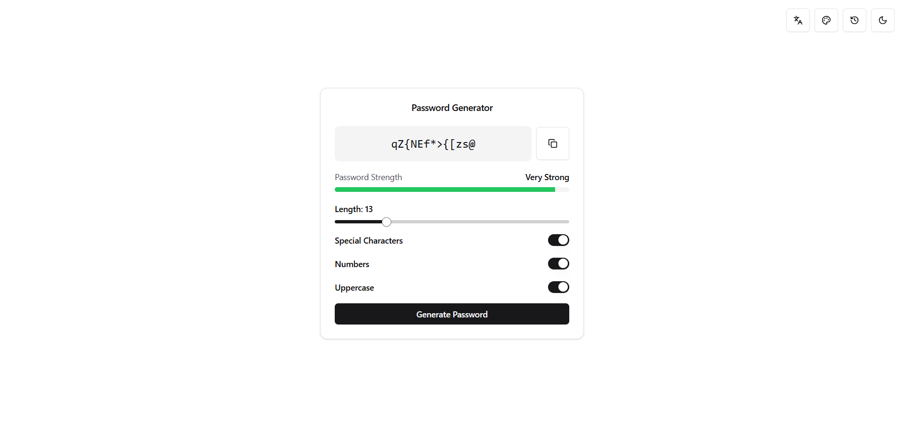

# Password Generator

Un moderno e sicuro generatore di password costruito con React, TypeScript e Framer Motion. Presenta un'interfaccia pulita con supporto per la modalità scura, opzioni multilingua e temi personalizzabili.

## Caratteristiche

- 🔐 Genera password sicure con opzioni personalizzabili
- 🌍 Supporto multilingua (Inglese, Italiano, Spagnolo, Tedesco, Francese)
- 🎨 Temi di colore personalizzabili
- 🌓 Modalità Chiara/Scura
- 📋 Cronologia password con funzionalità di copia
- 💪 Indicatore di robustezza della password
- ✨ Animazioni fluide con Framer Motion
- 📱 Design responsive
- 🔒 Pattern personalizzati per la generazione
- 👁️ Opzione per mostrare/nascondere la password
- 🎯 Interfaccia Dock per desktop
- 📱 Menu laterale per dispositivi mobili
- 🌈 Colori primari personalizzabili con color picker
- 🔄 Persistenza delle preferenze utente

## Stack Tecnologico

- React
- TypeScript
- Vite
- Framer Motion
- Tailwind CSS
- Shadcn/ui
- React Colorful
- Sonner (per le notifiche toast)
- Lucide React (per le icone)
- Country Flag Icons
- Lottie React